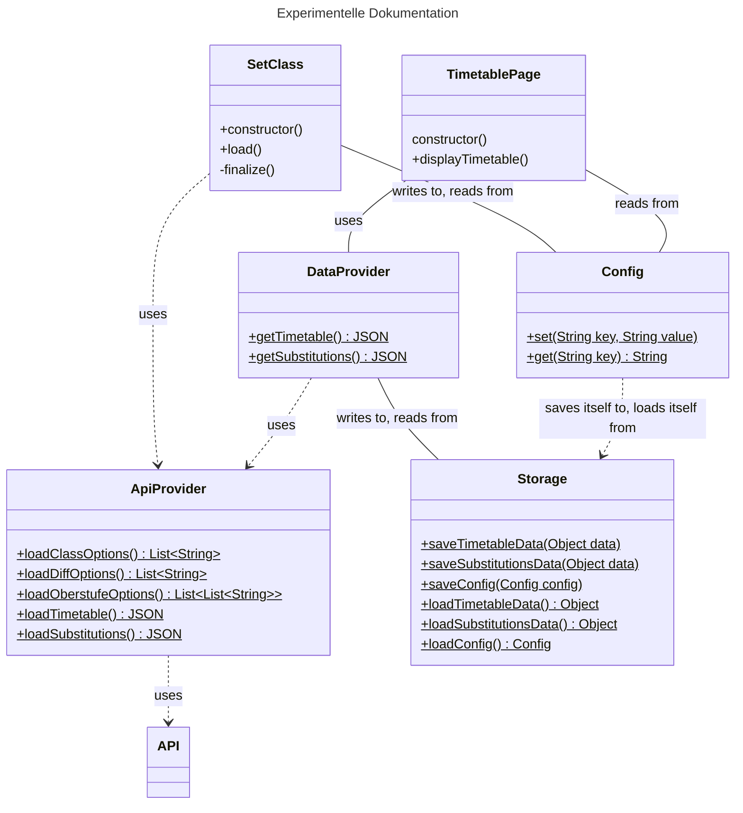

```mermaid
---
title: Experimentelle Dokumentation
---
classDiagram

SetClass ..> ApiProvider : uses
SetClass -- Config : writes to, reads from
TimetablePage -- Config : reads from
TimetablePage -- DataProvider : uses
DataProvider ..> ApiProvider : uses
DataProvider -- Storage : writes to, reads from
Config ..> Storage : saves itself to, loads itself from
ApiProvider ..> API: uses


class SetClass {
    +constructor()
    +load()
    -finalize()
}

class Storage {
    +saveTimetableData(Object data)$
    +saveSubstitutionsData(Object data)$
    +saveConfig(Config config)$
    +loadTimetableData()$ Object
    +loadSubstitutionsData()$ Object
    +loadConfig()$ Config
}

class Config {
    +set(String key, String value)$
    +get(String key)$ String
}

class TimetablePage {
    constructor()
    +displayTimetable()
}

class DataProvider {
    +getTimetable()$ JSON
    +getSubstitutions()$ JSON
}

class ApiProvider {
    +loadClassOptions()$ List~String~
    +loadDiffOptions()$ List~String~
    +loadOberstufeOptions()$ List~List~String~~
    +loadTimetable()$ JSON
    +loadSubstitutions()$ JSON
}
```
